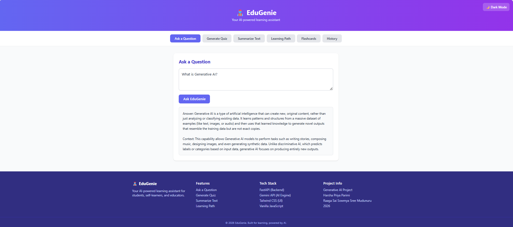
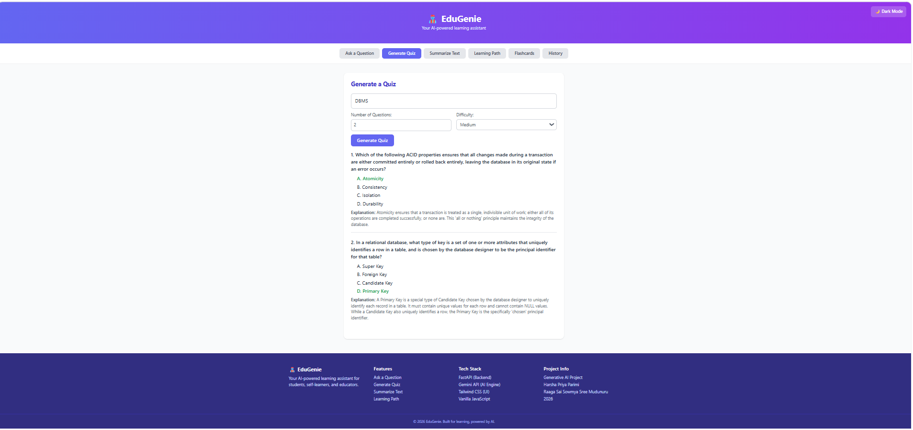
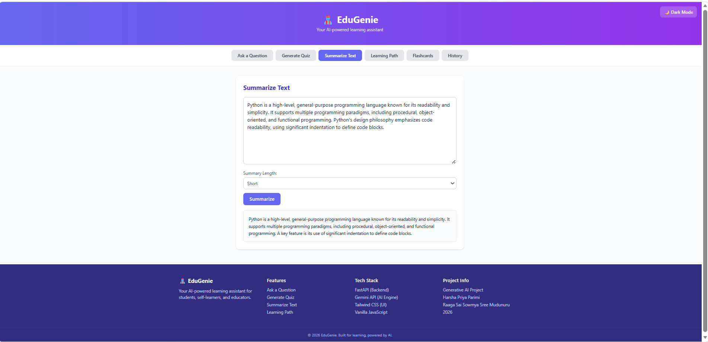
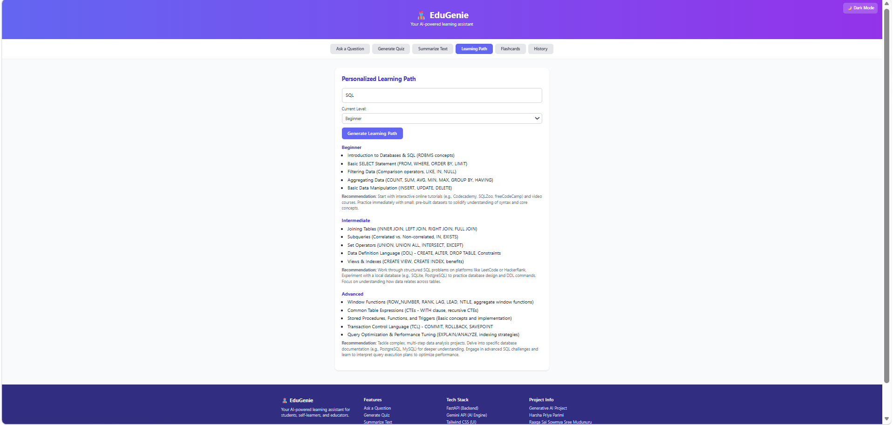
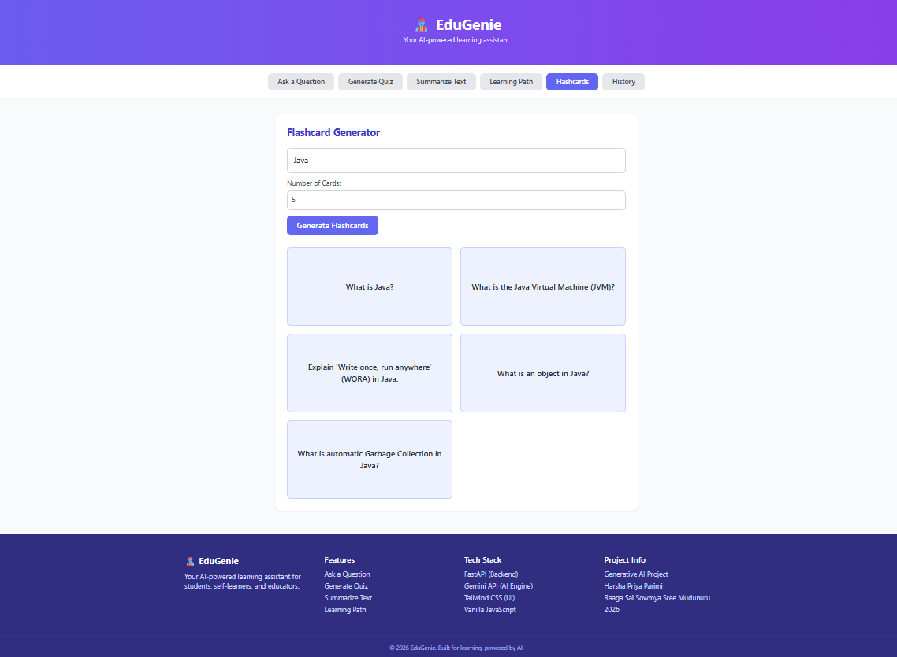
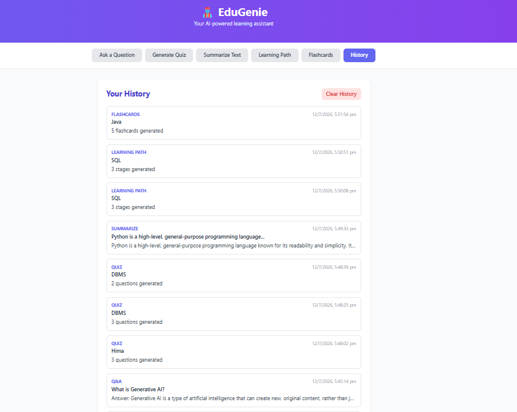
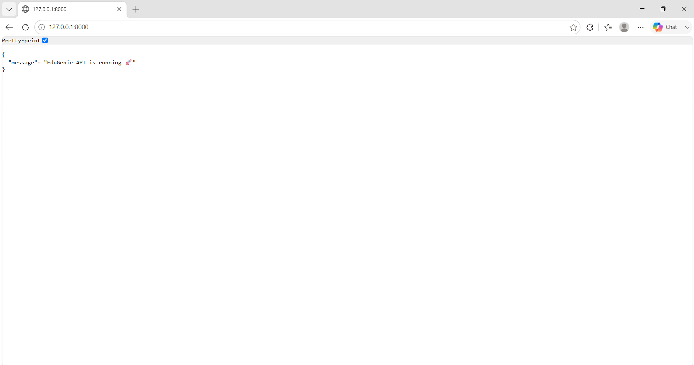

# 🧞 EduGenie – AI-Powered Educational Assistant

EduGenie is a lightweight, AI-powered educational assistant built to simplify and enhance the learning experience through the power of Generative AI. It's designed for students, self-learners, and educators who want quick, intelligent support across different subjects and academic levels.

Built with **FastAPI** on the backend and a responsive **HTML + Tailwind CSS + JavaScript** frontend, EduGenie combines cloud-based generative AI (Google Gemini API) with a clean, interactive interface to deliver fast, accurate educational assistance.

---

## ✨ Features

| Feature | Description |
|---|---|
| 🧠 **Intelligent Q&A** | Ask any question and get a clear answer plus extra educational context |
| 📝 **AI-Powered Quiz Generation** | Generate topic-specific multiple-choice quizzes with explanations |
| 📄 **Text Summarization** | Summarize study material into short, medium, or detailed summaries |
| 🗺️ **Personalized Learning Path** | Get a structured Beginner → Intermediate → Advanced roadmap for any topic |
| 🎴 **Flashcard Generator** | Auto-generate flip-style flashcards for quick revision |
| 🕘 **History** | Automatically saves your past activity across all features (stored locally in-browser) |
| 🌙 **Dark Mode** | Toggle between light and dark themes, preference remembered across visits |

---

## 🛠️ Tech Stack

**Backend**
- FastAPI (Python)
- Google Gemini API (`gemini-2.5-flash`) for generative AI responses
- Pydantic for request/response validation
- python-dotenv for environment configuration

**Frontend**
- HTML5
- Tailwind CSS (via CDN)
- Vanilla JavaScript (no framework)
- Browser `localStorage` for history and theme persistence

---

## 📂 Project Structure

```
EduGenie/
├── backend/
│   ├── app/
│   │   ├── main.py                  # FastAPI entry point
│   │   ├── routes/
│   │   │   ├── qa.py                 # Q&A endpoint
│   │   │   ├── quiz.py               # Quiz generation endpoint
│   │   │   ├── summarize.py          # Summarization endpoint
│   │   │   ├── learning_path.py      # Learning path endpoint
│   │   │   └── flashcards.py         # Flashcard generation endpoint
│   │   └── services/
│   │       └── gemini_service.py     # Gemini API connector
│   ├── requirements.txt
│   └── .env                          # API key (not committed to Git)
├── frontend/
│   ├── index.html
│   └── script.js
├── .gitignore
└── README.md
```

---

## 🚀 Getting Started

### 1. Set up the backend
```bash
cd backend
python -m venv venv
venv\Scripts\activate        # Windows
pip install -r requirements.txt
```

### 2. Add your Gemini API key
Create a `.env` file inside the `backend/` folder:
```
GEMINI_API_KEY=your_api_key_here
```
Get a free key from [Google AI Studio](https://aistudio.google.com/apikey).

### 3. Run the backend
```bash
uvicorn app.main:app --reload
```
The API will be running at `http://127.0.0.1:8000` (interactive docs at `/docs`).

### 4. Open the frontend
Simply open `frontend/index.html` in your browser — no build step required.

---

## 📸 Screenshots

### Ask a Question


### Generate Quiz


### Summarize Text


### Learning Path


### Flashcards


### History Mode


### Backend Mode


---

## 👥 Contributors

- Harsha Priya Parimi
- Raaga Sai Sowmya Sree Mudunuru

---

## 📄 License

This project was built for educational purposes as part of a Generative AI project.
